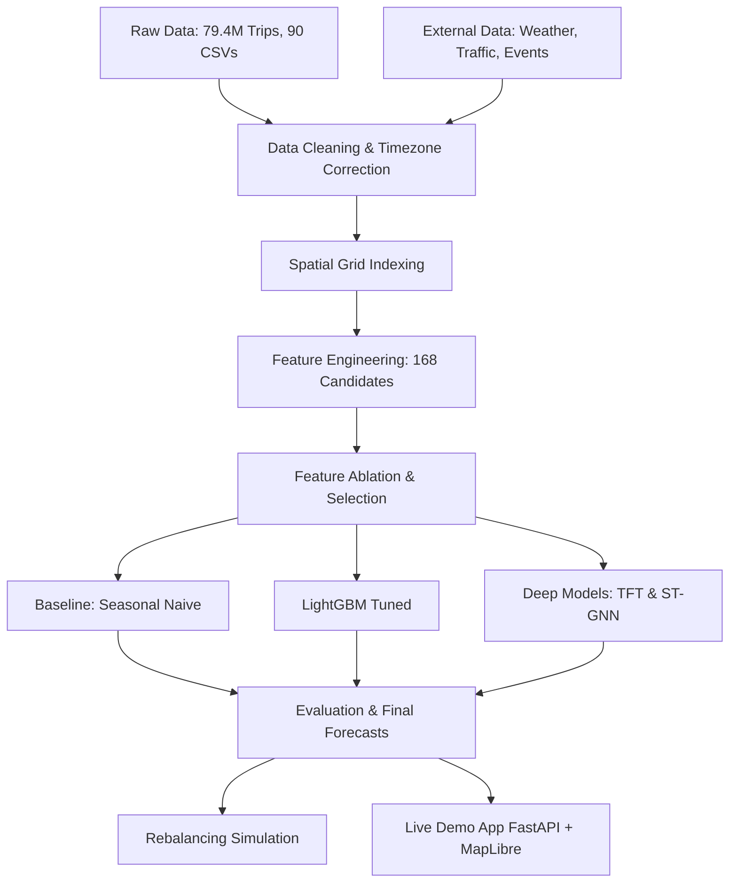

# GeoPulse

Short-horizon bike-share demand forecasting for NYC Citi Bike, with a rebalancing simulation and a live demo app.

Covers 2023–2024 (79.4M trips, 90 raw monthly CSV files). Forecasts pickups and dropoffs per spatial region, 15 to 60 minutes ahead. Built to answer four specific questions — which grid resolution works best, does the tiling scheme (H3 vs S2) matter, can a deep model beat a tuned tree model, and does a better forecast actually improve rebalancing operations.

All results below are real numbers from `outputs/metrics/`. The test set was opened exactly once.

---

## Methodology



---

## Results

**Final model (LightGBM, H3-8, 15-min-ahead pickups, Nov–Dec 2024 test set, 1.87M rows):**

| Model | MAE | RMSE | WAPE | Hotspot-F1 |
| --- | --- | --- | --- | --- |
| **LightGBM (tuned)** | **1.14** | 2.20 | 0.357 | 0.725 |
| ST-GNN | 1.20 | 2.42 | 0.369 | **0.726** |
| TFT | 1.29 | 2.51 | **0.352** | — |
| Seasonal Naive | 1.84 | 4.19 | 0.577 | 0.627 |

LightGBM beats both naive baselines by ~38% on MAE. It wins outright at S2-13 on every metric; the thin TFT WAPE and ST-GNN Hotspot-F1 edges at H3-8 both reverse at S2-13.

One caveat worth stating plainly: TFT and ST-GNN trained for only 8 epochs on a free Kaggle T4 (~23 GPU-minutes total) and were still improving at the last epoch. LightGBM trained to genuine early-stopping convergence (569–1,101 rounds, 48 min CPU). These numbers tell you which is the better value here, not which architecture has a higher ceiling.

---

## What the ablation found

168 candidate features across 8 families, added cumulatively. Run twice — once at H3-9, once at the chosen H3-8 resolution.

| Family | Features | Δ MAE (H3-8) | Verdict |
| --- | --- | --- | --- |
| A — demand_recent (lags) | 21 | baseline | — |
| B — calendar_seasonal | +55 | **−6.6%** | the real lift |
| C — rolling_trend | +49 | −0.6% | marginal, kept |
| D — weather | +17 | ~0% | no effect |
| E — events | +6 | ~0% | no effect (25% unmapped) |
| F — traffic | +7 | ~0% | no effect (even after 4× coverage) |
| G — spatial_neighbor | +9 | −0.3% | not enough to include |
| H — station_network | +4 | ~0% | no effect |

**Final feature set: A + B + C only (125 features).** Nearly all the predictive signal beyond recent demand is time-of-week seasonality. Weather, events, and traffic were each given a fair shot and measured at essentially zero. That's reported as a finding, not a failure — it means three feature pipelines can be dropped in production at no accuracy cost.

---

## Rebalancing simulation

14 days of the test period, 1,348 steps across 321 regions. Capacity estimated from the q95 of each station's net-flow range (median 15 docks). No historical dock-occupancy data exists for 2023–2024.

| Forecast | Safety | Service level | Unserved pickups | Bikes moved |
| --- | --- | --- | --- | --- |
| No rebalancing | — | **0.9958** | **8,540** | 0 |
| Perfect foresight | 5% | 0.9940 | 12,294 | 9,286 |
| **LightGBM** | **5%** | **0.9942** | **11,904** | **7,720** |
| Seasonal Naive | 5% | 0.9939 | 12,391 | 9,531 |

Two honest findings:

- **Among forecasts, LightGBM wins** — and it wins by moving fewer bikes (2,107 moves vs. 2,615 for perfect foresight). It under-forecasts slightly, which triggers less intervention, and in this regime intervention is net-harmful.
- **Rebalancing itself doesn't pay at region granularity.** Every intervention scenario makes things worse than doing nothing. At H3-8, each region aggregates ~7.7 stations and ~115 docks against a median of ~3 trips per 15-min bin — the region basically never runs dry. The real problem is at station level, which needs dock-occupancy data this project doesn't have. That's reported rather than tuned away.

---

## Spatial system comparison

| System | Regions | Area km² | Skill vs Naive | Hotspot-F1 | Build MB | Train (s) |
| --- | --- | --- | --- | --- | --- | --- |
| **H3-8** | 321 | 0.74 | 0.256 | 0.748 | 430 | 32 |
| S2-13 | 231 | 1.09 | **0.274** | 0.769 | 328 | 24 |
| H3-9 | 1,483 | 0.11 | 0.192 | 0.590 | — | — |
| H3-10 | 2,162 | 0.015 | 0.179 | 0.481 | — | — |

Skill vs Seasonal Naive is the right metric here — raw MAE and WAPE move mechanically with cell size in opposite directions, so they can't compare across resolutions. S2-13 edges H3-8 on skill, but its cells are 47% larger; the gap is plausibly just residual coarseness. The tiling scheme barely matters; resolution is the real decision.

---

## Architecture

Eight sequential phases, 24 numbered scripts, each with a Definition-of-Done gate:

```
Phase 1  — ingest 90 raw CSVs, clean (14 rules), timezone/DST correction, weather,
           events, traffic, station registry, dev sample
Phase 2  — spatial panel: region × 15-min time series, ~104M rows, h1–h4 targets
Phase 3  — baseline: Seasonal Naive + 8 LightGBM models (STOP-AND-VERIFY gate)
Phase 4  — 168-feature table across families A–H, ablation → A+B+C decision
Phase 5  — H3 resolution sweep, S2 matching, H3 vs S2 comparison
Phase 6  — Optuna-tuned final LightGBM, hand-written TFT and ST-GNN
Phase 7  — single final TEST evaluation (opened exactly once)
Phase 8  — capacity/inventory estimation, shortage/surplus, rebalancing simulation
```

The panel and feature table were built within a 16 GB RAM laptop — month-by-month sort instead of global ORDER BY, batched lag windows, 25% training subsample with full validation/test scoring. Deep models (TFT: 239k params, ST-GNN: 35k params) run identically on CPU or GPU; they just ran on a Kaggle T4 for convenience.

---

## Repo layout

```
configs/      one YAML per concern (base, h3, s2, lightgbm, tft, stgnn)
scripts/      24 numbered pipeline scripts, one phase per file
src/
  data/       ingest, clean, timezone, traffic
  spatial/    H3 and S2 indexers (DuckDB bulk + Python boundary/neighbor)
  features/   basic (Phase 3) and advanced A–H (Phase 4) feature families
  models/     LightGBM baseline, hand-written TFT + ST-GNN (deep.py)
  evaluation/ metrics, error analysis, hotspot detection
  inventory/  capacity estimation, shortage/surplus
  rebalancing/ greedy rebalancing simulation
  serving/    predict.py (one function, one row schema, any model or grid)
  agent/      deterministic keyword router + optional Claude tool-use
app/          FastAPI server + map frontend
notebooks/    kaggle_phase6_deep.py (shipped as script so GPU run stays in sync)
docs/         DATA_SOURCES.md
outputs/      metrics/, reports/, experiments/ — all real results committed
tests/        146 tests: 82 passing on a fresh clone, 74 data-skipped,
              11 need station_registry.parquet (built by Phase 1, not committed)
```

---

## Demo app

FastAPI backend + map frontend. Click anywhere on NYC, get a demand forecast for that cell, nearby available docks, and a chat assistant that explains the prediction.

Works without any API key (deterministic keyword router as fallback). Optionally uses Claude if `ANTHROPIC_API_KEY` is set. The assistant has explicit honesty rules baked in — it can't attribute demand to events or weather, because the ablation showed those features are noise.

```bash
uvicorn app.server:app --reload --port 8000
# open http://localhost:8000
```

---

## Running it

```bash
python -m venv .venv && source .venv/bin/activate
pip install -r requirements.txt

make phase1        # ingest → clean → weather → events → registry → dev sample
make phase1check
make phase2        # spatial panel
make phase2check
make phase3        # features + baseline models
make phase3check
make test          # pytest
```

Raw data (Citi Bike trip CSVs, ~15 GB for 2023–2024) is not committed — see `docs/DATA_SOURCES.md` for download links. All metrics, reports, and decisions from the completed run are committed under `outputs/`.

Phase 6 deep models need PyTorch separately:

```bash
pip install torch   # ST-GNN is hand-written; no torch-geometric required
```

---

## Stack

- **Data**: Polars, DuckDB, Pandas, PyArrow, Parquet
- **Spatial**: H3 (v4), s2sphere, GeoPandas, Shapely
- **Modelling**: LightGBM, Optuna, PyTorch (TFT + ST-GNN hand-written, no pytorch-forecasting dependency)
- **App**: FastAPI, Pydantic, Uvicorn, MapLibre GL
- **Testing**: pytest (146 tests)
